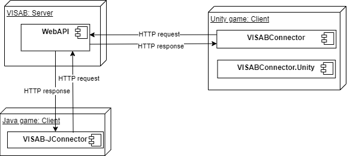

# Deployment View

For communication between game and VISAB, VISAB serves as the server and the games as the clients. Whilst it is possible, to run VISAB and the games on different machines, it is ofcourse not mandatory.

Games implemented in C# can use the [VISABConnector](https://github.com/VISAB-ORG/VISABConnector/) library that provides a C# interface to VISABs WebApi. Additionally, if the game is implemented on top of the UnityEngine, VISABConnector.Unity may be used to perform Unity specific image extraction.

Games implemented in Java can use the [VISAB-JConnector](https://github.com/VISAB-ORG/VISAB-JConnector) library, that serves the same purpose as the VISABConnector just for java. This library is only a prototype currenlty, meaning that not all functionality is guaranteed to be working and the code base does not conform to Java standards.

Language independant communication can be achieved through creating HTTP requests directly or optionally writing an interface in the language.