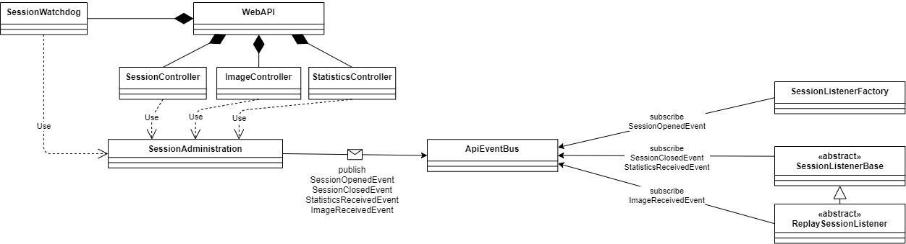

# Component Connector View

#### WebAPI - Processing Connection View

To achieve seperation of concerns, loose coupeling and enable scalability (through asynchronous event publishing)
VISAB simply delegates information received to the processing modules using the Publish-Subscribe design pattern.

The WebApi, or rather the specific controllers, forward information received through HTTP requests to the SessionAdministration. The SessionAdministration then creates a new event by using that informtion and publishes it to the APIEventBus. The APIEventBus then forwards that event to the subscribes of the event type.

There are three classes in VISAB that subscribe to API events.
1. SessionListenerFactory: Subscribes only the SessionOpenedEvent and creates a new ISessionListener instance on occurance.
2. SessionListenerBase: Subscribes the SessionClosedEvent and the StatisticsReceivedEvent.
3. ReplaySessionListenerBase: Additionally subscribes to the ImageReceivedEvent.

For more information regarding the specific types of API events, refer to the the graphic below.

#### API Event Overview
