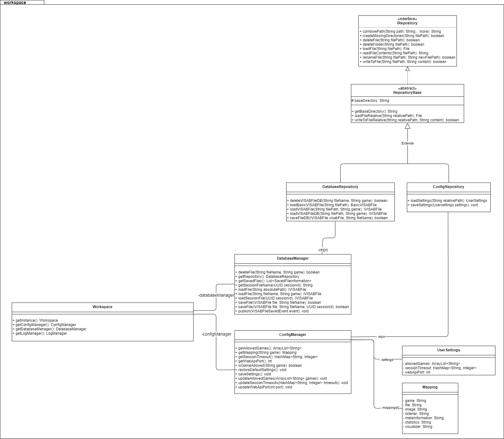

# Module Views

#### Workspace Package Overview

The `workspace` package serves the purpose of persisting and accessing persistant data at runtime. The `Workspace` class functions as an access provider for the `DatabaseManager` and  the `ConfigManager`. The managers have functionality for loading, modifying and saving data such as the settings or VISAB files. All IO operators are done using the specific repository classes.
Settings, VISAB files, and log files are persisted in a dedicated **workspace/** directory, that can be administrated using the GUI.

The workspace is also used to access the game specific class mapping that is set in the `classMapping.json` file.

#### Visualizer View Overview