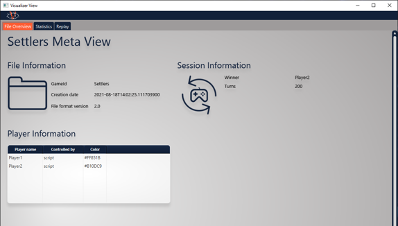
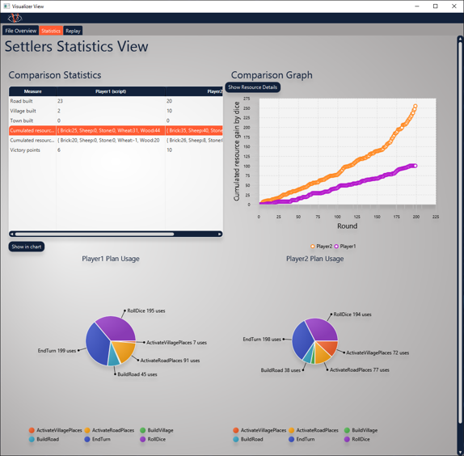

# Visualizer Views

The core competence of VISAB is to illustrate agent behaviour in games. Consequently VISAB needs to have fitting views implemented that 
provide useful information extracted from the game data and show them in a clear by allowing multiple different view points.

This page describes the underlying visualizer concepts and gives hints about the current set of implemented visualizers in VISAB.
If you want to have a deeper look on how to control the UI from user perspective, please have a look at the [GUI Usage Article](https://visab-org.github.io/getting_started/usage.html).

VISAB is designed in a fashion, where any type of game may have their own set of visualizers (each visualizer adresses a different view point)
that may be useful to illustrate certain aspects of the game. However, VISAB in its current state, implements three different types of visualizers
for both **Settlers of Catan** and the **CBRShooter** which can be seen as a recommended set that should fit for any game you might want to integrate.

Due to the fact that each visualizing view is very custom regarding the respective game, there are no code samples provided. 
If you want to learn about the practical implementations, please have a direct look into the [GitHub Repository](https://github.com/VISAB-ORG/VISAB).

Please note that when implementing Views, the MVVM pattern has to be followed, so that any game will
have at least two classes that realize the respective view, e.g.: 

- AnyGameReplay**View**: Is only responsible for how the UI elements are displayed in the UI
- AnyGameReplay**ViewModel**: Is responsible for data access across the underlying model and provides it for the view class

Furthermore, the related .fxml has to have the exact same name as the as the view, e.g.: <code>AnyGameReplayView.fxml</code> and also must be
located under the exact same package pathing within src/main/resources to be automatically locatable by the <code>FluentViewLoader</code> of JavaFX/mvvmfx.

## Meta (File) View ##

The meta view is used to provide static information of the VISAB file which are valid by the end of it.
For example it may contain general information about items in the game, the winner of the whole session, etc.

<em>This view is very basic and features no interactiveness and should be rather simple to implement.</em>

## Statistics View ##

The statistics view aims at providing cumulated information for each player that is well comparable. 
For example, it is highlighting the plan usage for each player very in separate charts.

<em>This view has some interactive options such as showing the comparison between some players for a specific measure.
Here you need to be careful about how to fill the respective graphs with data, because JavaFX sometimes shows strange behaviour
if the refilling of graph data is not done smoothly.</em>

## Replay View ##

The replay view fills another gap, the statistics view still leaves open.
It may be interesting to replay a match or any specific moment of it as often as you like to get a better insight 
of what circumstances in the game may have lead to specific decisions of the AI bots competing against each other. 

<em>The replay view is the most complex view at the current state of VISAB. Due to this fact, there are some things to watch out for while implementing:
- The underlying map image is correctly scaled in terms of width and height
- The game objects need to be positioned correctly by translating their game coordinates to the JavaFX GUI boundaries of the map image
- Be careful on how and when to set the game objects to the scene graph in JavaFX due to performance issues.
	- For example completely replacing all of them at each turn might take too long and it will cause the slider to behave strange
- Due to its capability of going **forward** and **backward** in the game data, visualization of all map objects has to be handled in a reasonable way
	- For example moving the turn slider back from 60 to 40 should correctly hide objects that were not there in turn 40 of course
</em>

