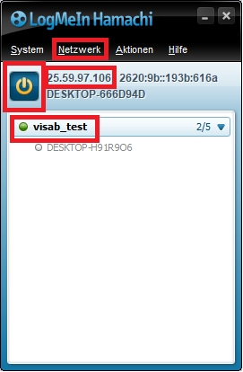
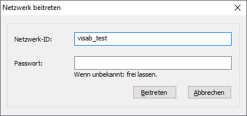

# Connecting to VISAB from a Different Machine

VISABs WebAPI is accessible either **directly on your own local machine**, if you run both the game and VISAB or you can 
access a running instance of VISABs WebAPI **on another machine** and simply send only game data from your machine.

In any case you need to make sure that the IP adress and port* is configured correctly in the game for communication:

```csharp 
string hostAdress = "http://25.59.97.106";
int port = 2673;
int requestTimeout = 10; // You'll have to play around with the timeout.

var api = new VISABApi(hostAdress, port, requestTimeout);
```

*Find out your local IP adress, e.g. by opening the command prompt and entering `ipconfig`.* 

**Make sure that the port field corresponds to the port set in VISAB. You can change the port in the settings section of VISAB*.

If you want to send data to another machine that runs VISAB within the same local network you can simply ask for the 
above mentioned information and put them into your games configuration. 

## Connecting to VISAB from Another Network

In case of communicating between two different networks, things are little more tricky.

Say, we want to connect to VISAB from a different network, we need for example Hamachi to create a peer-to-peer network. 
First we need to join Hamachi's network by pressing the Power switch. A network needs to be created by pressing **Network -> Create Network** on the first machine.

Both machines have to be in the same hamachi network (here: **visab_test**) and the host machine's local address can be found in hamachi's user interface (here: **25.59.97.106**) . 



In order to join that network from another machine the user has to press **Network -> Join Network** and enter the network ID under **Network ID**.  A password only has to be entered if it was set priorly.
This way we can connect to any machine even if it does not run on the same local network.

