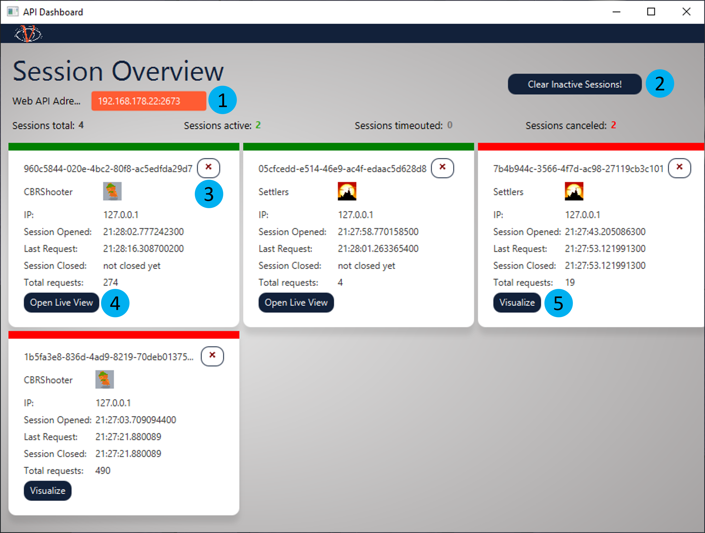

# GUI Usage Guide

Excited to use VISAB and get some insights about what it is capable of? 
This guide will provide a walkthrough to VISABs UI and explain all relevant elements of it.

## Home
#### light mode

The "Home View" has a navigation bar with  buttons to open the [API-Dashboard](#API-Dashboard) **(1)**, the [Settings](#Settings) **(2)** with an
included option to switch between light and dark mode **(11)**, the [About](#About) **(3)** and the [Help](#Help) **(4)** window. It also shows a view
of the file-system of the  local VISAB database. There are all files with filename, creation date and
size displayed, that belong to the VISAB supported games. The refresh button **(5)** can be used to reload the
database. With the "Show in explorer" button **(6)** the file system will be opened where the selected file or
folder is stored on the system. With the "Rename" button **(7)** a file or folder can be renamed. The "Upload" button **(8)**
opens the systems file explorer, where the user can upload an existing VISAB file to the workspace.
This is also possible via drag and drop into the HomeView. With the "Delete" button **(9)** the selected file or
folder can be deleted. The "VISUALIZE" button **(10)** will open the [Visualizer view](#Visualizer) if a VISAB file is selected.

#### dark mode

## Visualizer

When a user selects a file from a game in VISAB and presses the "VISUALIZE" button **(10)**, the Visualizer view is loaded. 
The view contains three tabs **(1)**: File Overview, Statistics and Replay. 
- The **meta view** is used to provide static information of the VISAB file which are valid by the end of it.
- The **statistics view** aims at providing cumulated information for each player that is well comparable.
- The **replay view** as a counterpart to the statistics view serves the purpose of re-experiencing specific moments of the game over and over whilst highlighting information according to the users needs.

*Because the visualizers are designed similarly for both games, they will be described once with highlighted differences.*

### Meta View

The "Meta View" provides information about the respective file itself, the underlying session information as well as static game information such as 
the players and how / by whom they are controlled. The "CBR Shooter Meta View" further contains weapon information. 

*Any other static data could also be displayed here.*

#### Settlers Of Catan

#### CBRShooter

### Statistics View

The "Statistics view" consists of a comparison statistics table with a "Show in chart" button **(1)**, a comparison graph **(2)** and a section with 
pie charts **(3)** indicating the plan usage distribution for each participating player / bot. For Settlers of Catan, there is also a "Show Resource Details" button **(4)** available,
that is capable of giving a more complex insight about only the resource-related rows of the comparison statistics table in a [Detail View](#Statistics-Detail-View).

In the comparison statistics table, the statistics for each measure are compared between players and can be viewed in a line 
graph when a line is selected and the "Show in Chart" button **(1)** is pressed.

#### Settlers Of Catan

#### CBRShooter

##### Statistics Detail View

The "Detail View" illustrates the resources for each player in each round are displayed in a stacked bar chart with different colors for every resource. 
The displayed rounds can be changed (*in intervals of 10 rounds*) by moving the slider **(1)** back and forth.

*Please note that JavaFX reassigns the colors for each resource when the slider is moved to another interval.*

### Replay View

The "Replay View" displays the map of the underlying game data. Furthermore it has several capabilities of modifying the visible content to enhance the users focus on specific aspects.
As the name already indicates, the view can be played and paused by pressing the designated button **(1)**. Additionally the velocity (speed in which the map data is updated) can be adjusted
with a slider **(2)**. If you want to jump to a specific moment of the game data, you can also directly use the turn slider **(3)**. The visuals table **(4)** gives information about player-specific 
color-coded visuals and offers the possibility to hide certain objects or even the whole player by simply un-checking the respective check boxes. The color-coding is implemented to optimize the 
visual distinction between the different players and relies on colors provided by the game itself. If the color-coded items are hardly separatable from the underlying map, there is also an option
to check "Show in black and white" **(5)** to grey-scale the map image. The CBRShooter also contains items that are not player-specific, which can also be hidden by un-checking their respective
check boxes **(6)**. The "light-blue bubbles" indicate the changes applied to the view by utilizing the previously mentioned options.

#### Settlers Of Catan
##### colorized / all items visible

##### greyscaled / some items hidden

#### CBRShooter
##### colorized / all items visible

##### greyscaled / some items hidden

## API Dashboard

The "API Dashboard" exposes the most important informations of VISABs underlying HTTP API which is used as the communication interface with the respective games. 
To configure the connection in the game correctly, VISABs adress can be directly copied from a text field **(1)**. Below you will find an overview of all transmission 
sessions and their respective status and details. By clicking the "Clear Inactive Sessions!" button **(2)** all sessions that are either timeouted (grey) or canceled (red) will be removed from the overview.
Any active (green) session can be canceled from VISAB side by clicking the "X" button **(3)**. VISAB also offers the option to show the [Visualizer view](#Visualizer) for a session in a live mode* **(4)** while it is still running.
After a session has ended, the "Open Live View" button **(4)** changes into a "Visualize" button **(5)** which also opens the [Visualizer view](#Visualizer) just as you do from the [Home view](#Home) file explorer.
For each session several informations are shown like the name of the game, the ip-address, the opening time of the session, the time of the last request, the time when the session was closed and the total amount of 
request that were sent in the during the transimission session. 

**The live mode also uses the same visualizers as the regular mode, but the data updates are performed incrementally on each request done by the game, which gives a nice look and feel for the charts being dynamically updated and the replay view more or less being on the same status of the real running game*

## Settings

The "Settings View" offsers several options to configure VISAB. The Web Api Port can be directly changed in the text field**(1)**. 
The "Session Timout" **(2)** and the "Allowed Games" **(3)** offer Edit buttons to open the respective "Edit View". Furthermore there is an option to restore the default settings on button press **(4)**.
Lastly, for any change to be made persistent a "Save" button **(5)** needs to be pressed. 
Editing the session timeout can be done by choosing the game **(6)** from the select box and adjust the session timeout in the text field **(7)**. 
The edit view for The Allowed Games offers the possibility to add a new game **(8)** to VISAB or to remove a selected game **(9)** from VISAB. 
With the "Return" button the "Edit View" will be closed and the made changes need to be saved in the "Settings View". 

## Help

The "Help View" shall help anyone using VISAB by providing important information in utilizable formats. By clicking on the specific tab **(1)**
one can either have a look into the [Video tutorial](#Video-Tutorial) or into the [PDF documentation](#PDF-Documentation)

#### Video Tutorial

The "Video Tutorial" tab contains a [video](https://www.youtube.com/watch?v=znG2ZtcAfqA) that is directly embedded from YouTube and can be either viewed in the application itself or 
in the web browser if you click on "Ansehen auf YouTube / View on YouTube" **(2)**. The video explains how VISAB works and what it is used for.

#### PDF Documentation

The "Documentation" tab contains a PDF viewer **(1)** with all basic features that you would expect. A user can simply scroll through the document and even search 
for specific key words with ctrl+f.

## About

The "About View" contains a tab **(1)** for every VISAB version. In the VISAB 1.0 tab all developers with names and mail addresses **(2)** are mentioned. 
In the VISAB 2.0 tab the developers are also mentioned with their names and mail addresses **(2)**. Furthermore a rough overview of all new features, compared to VISAB 1.0, 
are displayed in a list **(3)** in the VISAB 2.0 tab. 

*The tab structure offers a comprehensive way of illustrating VISABs current and also future progress throughout the different versions.*

