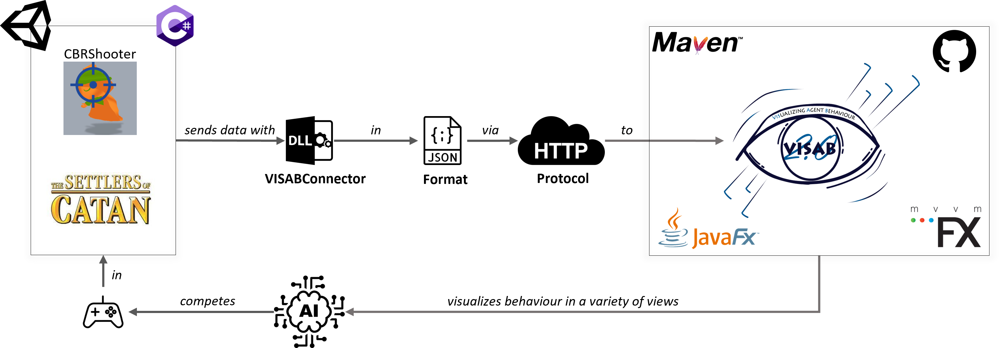

# The VISAB Toolset

### Welcome to the VISAB online documentation powered by [DocFX!](https://dotnet.github.io/docfx/)

VISAB stands for **VIS**ualizing **A**gent **B**ehaviour and can be bestly described as a tool that is 
capable of communicating with games to extract game information und illustrate it for AI developers to have a deeper
insight into the bot implementation's behaviour with perfectly tailored views for each specific game. To cover the full stack of required 
use cases VISAB comprises a toolset which contains the following:

- VISAB: A standalone maven-powered Java application, usable on Windows, Mac and Linux that provides a variety of features for AI behaviour debugging.
- VISABConnector: A C# library that can be deployed in a unity game to communicate with VISAB and provide the necessary information for visualization.
- VISABConnector.Unity: A kind of sub module within the VISABConnector that can be used to perform snapshots of real game objects and send them to VISAB
to enhance the user-experience by having the exact same visuals and map just as in the original game.

### VISABs Overall Context

In order to give a very quick and abstracted overview of how VISAB can be seen in context, the following graph shall illustrate the most relevant anchor points
of VISABs current state and components involved in the overall workflow.

### Online Documentation Content

This online documentation aims at helping developers and users to understand how VISAB and its toolset works and guide further extensions to it.
Under [Documentation](https://visab-org.github.io/documentation/index.html) you will find more general information on how VISAB is built, how it is working and what 
the underlying concepts are. [Getting Started](https://visab-org.github.io/getting_started/index.html) aims at helping both users and developers to get a starting point for the VISAB toolset
by offering hands-on guides on various things. In [Code Samples](https://visab-org.github.io/code_samples/index.html) some abstracted sample implementations with the example of [Tetris](https://tetris.com/play-tetris)
are shown to give a deeper insight on how to extend the code base to support other games. Furthermore the API code documentation of the [VISABConnector](https://visab-org.github.io/api_visabconnector/index.html) and [VISAB](https://visab-org.github.io/api_visab/index.html)
can also be viewed.

Please visit the [VISAB-ORG on GitHub](https://github.com/VISAB-ORG)!

*Developed as an IT study project at the [University of Hildesheim, IIS](https://www.uni-hildesheim.de/fb4/institute/ifi/intelligente-informationssysteme-iis/)*

